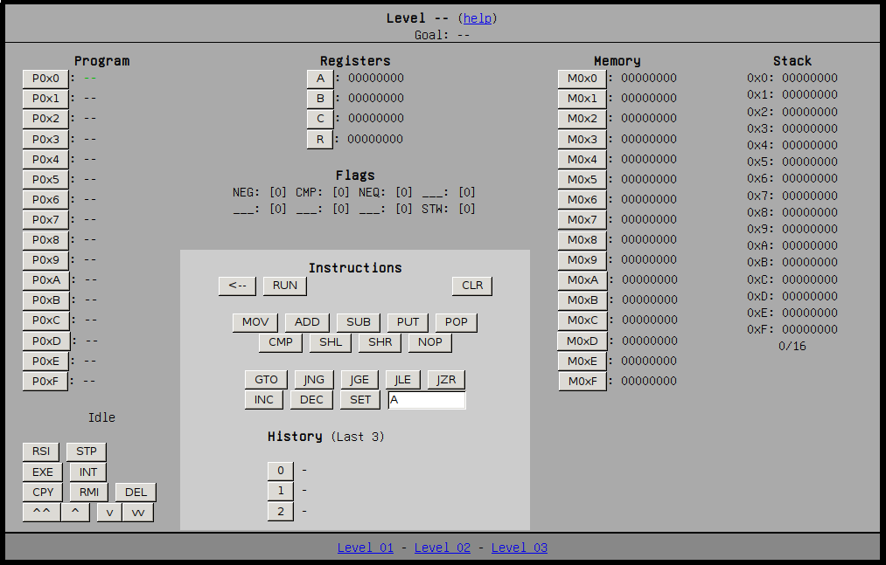
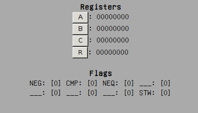
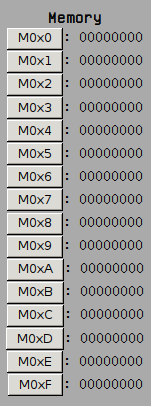
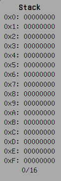
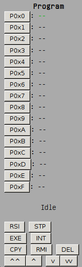

## Intro

This is CPyou, a puzzle game inspired on assembly programming. In it you can control a microprocessor by choosing between CPU instructions. You must solve the puzzles moving and processing the data you are given in the memory.

The documents in this folder are a general overview of the game and may not cover everything. If you are still confused after reading this or saw something not in the docs, please open an issue on github or make a PR with the changes yourself. Thanks! :)

### General information

While you don't need to be an assembly expert to play this, you'll need to learn some things before using it. Here are some general tips & tricks, and things you'll probably find weird.

* All the data you see his in hexadecimal (Base 16)

Everything in the memory, registers, etc is in hexadecimal format. Hex is base16, and just like base10 using the symbols 0-9, it uses 16 symbols: numbers 0-9, and letters A-F. So, for example, 9-10-11 in hexadecimal would be 9-A-B. It takes a while to get used to, but you'll eventually get it.

* You only have 2 slots to do everything

If you have programmed with any higher level programming language such as python, you'll be used to working with as many variables as you want. In assembly you work with a limited number of slots you can put your information in. In this case, you have two registers, A and B, that you must use to process the information and complete the level.
So if you are doing something and need to add two numbers, you'll need to save your progress somewhere else.

* You have a stack

Again, if you have programmed with something, chances are you haven't bothered using stacks. But if you want to complete some of the levels, you'll have to get used to it. More info further in this document.

* Instructions have weird names

If you want to, say, add A and B, you do A+B, right? Not here. Most of the time the instructions assume you've already placed what you want to process correctly in the registers, and will use whatever is in them as "arguments". To follow with the adding example, you'll need to put A in one register and B in another, and then call `ADD`, which will add whatever is in A and B together and will put it in R (Regardless of what you had previously stored there)  
The instructions also have weird 3 letter names. For obvious reasons (I don't really know anything about assembly and I'm just making the names up) they are not the exact same names you may find in actual assembly, but they get close. They act as mnemonic rules for what the instructions do. So, for example, `ADD` stands for 'add' (duh), `CMP` stands for 'compare', and so on.

### Overview

This is the general game layout. If you are familiar with computer architecture everything is probably familiar to you and you can safely skip this.

If not, here's a quick walkaround.

#### Level and level goal, help link

This is the top bar. In here you can see the current level you are playing, and the goal of that level.  
You can also see a `help` link that will show a simplified help image over the game layout if you get lost.

#### Registers

Registers are small positions where processors store the information they are working with. You can think of them as memory slots the instructions can work with.  

There are 5 registers in this fictional CPU:

* *A* and *B* are general purpose registers. You can store whatever you want in here, and instructions like `ADD` and `SUB` will process what's in them. 
* *C* is the counter register. You can't move things to or from it, but you can store a number and use it to count loops. As you'll see there are instructions to increase and decrease this number.
* *R* is the result register. The results of the different operations (`ADD`, `SUB`, etc) will be automatically stored here.
* The *FLAG* register is a special 8 bit register that can't store information as *A* or *B* can. Instead, every bit of this register serves as a status indicator. For example, the first position (`NEG`) indicates that the result of the last instruction was negative.

The complete list of flags:

* `NEG` -> 1 if the result of the last instruction was negative
* `CMP` -> Modified by the CMP instruction (1 if A>B, 0 if A<=B)
* `NEQ` -> Modified by the CMP instruction (1 if A!=B, 0 if A==B)
* (empty)
* (empty)
* (empty)
* (empty)
* `STQ` -> Stack warning. Set to 1 when 14 of the 16 positions of the stack are full

#### Instructions and history

Instructions are what the CPU uses to process the data. You can choose which instruction to run, and to either run it directly or store it in program memory for future use.  

You can compose different instructions by pressing in the instruction buttons and the memory/program positions

Here's an overview of the buttons in this area:

* `<--` Stores the current instruction in the program. You must select the program slot you want to put the instruction in.
* `RUN` Runs the instructions as-is, without storing it in the program. Instructions run in this mode will also be stored in the history (See below) for future use.
* `CLR` Resets the instruction slot

Below these buttons are the general instructions and the program-specific instructions (See 02-instructions.md for more information)

The history shows the last 3 instructions that were manually run with the `RUN` button. It stores the last 6 instructions, but only 3 are shown to save space.

#### Memory

Like all computers, cpyou uses memory to store data. The information you are given for a level will be stored here, and you'll need to put the results of what you do here to be validated.

You can move information in or out of the memory using the `MOV` instruction.

You can't store instructions in the memory, just data.

#### Stack

The stack is a special data structure you can use to temporarily put the data you won't be needing in your program.

It's accessed in a FILO(First In, Last Out) order, just like a stack of pogs. You can put some information on top of the stack, or get whatever it is in the top from the stack.

You can move things between the stack and the registers with the `PUT` and `GET` instructions (See instructions for more info)

#### Program

The program memory is where you store instructions to be run in order. This allows you to make and run assembly programs just like in real life(tm)!

Once you compose an instruction in the instruction area, press the `<--` button and select a program position. Whatever it is on the instruction slot will be moved to that position, given that it is a valid instruction. The current instruction is highlighted in green.

The buttons in the bottom of this area allow you to run, stop and move around the program.

* `RSI` (Run Single Instruction) lets you choose a program slot. It will run that instruction without modifying the Instruction Pointer.
* `STP` (STeP) lets you run a step in the program. It will execute whatever instruction is highlighted in green and then increase the Instruction Pointer.
* `EXE` (EXEcute) will run the entire program, like continuously pressing `STP`. The program will continue running until you win, lose or until the Instruction Pointer reaches the last program slot (P0xF)
* `INT` (INTerrupt) will stop the execution of the program after pressing `EXE` in the next step.
* `CPY` (CoPY) will copy the instruction in a slot to another slot.
* `RMI` (ReMove Instruction) will remove the instruction in a given slot
* `DEL` (DELete) will clear the entire program. *Everything* will be erased (You'll need to press it twice to confirm you really want to do this)
* `v` and `^` will increase or decrease the Instruction Pointer by 1
* `vv` and `^^` will move the Instruction Pointer to the first or last instruction