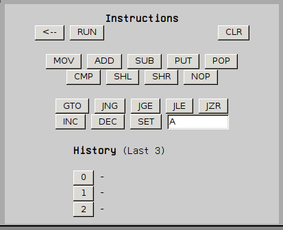

## Instructions

The game has several instructions, grouped in the `instructions` area. 

Those located in the top part are general instructions that can be run directly from the instruction slot, and those in the bottom part can only be executed from a running program.

The names of the instructions are mnemonics for what they actually do, so after a while you'll be familiar with the nomenclature.

### General instructions

#### MOV X Y 

Moves the contents of X to Y  
Only A, B, R and memory positions are allowed

#### ADD 

Adds A and B and puts the result in R

#### SUB

Subtracts A and B and puts the result in R. If A is greater than B, then the NEG flag is set to 1

#### PUT X

Puts a value from X in the stack  
X must be A, B or R

#### POP X

Gets a value from the stack and puts it in X  
X must be A or B

#### CMP  

Compares A and B  
If A is greater, the CMP flag is set to 1  
If A is less or equal, the CMP flag is set to 0  
The NEQ flag shows if the two numbers are equal (0) or not (1)

#### SHL X

Shifts bits to the left in X  
X must be A or B

#### SHR X

Shifts bits to the right in X  
X must be A or B

#### NOP  

Does nothing

### Program-only instructions

All the goto (GTO) and jump (J--) instructions modify the Instruction Pointer so the next instruction executed is the one located in P  
To practical effects, they behave like regular gotos

#### GTO P

Goes to instruction P  

#### JNG P

Jump to instruction P if the negative flag (NEG) is 1

#### JGE P

Jump to instruction P if the CMP flag is 1

#### JLE P

Jump to instruction P if the CMP flag is 0 and the NEQ flag is 1

#### JZR P

Jump to instruction P if the counter register C is 0

#### INC  

Increase counter register C by 1

#### DEC  

Decrease counter register C by 1

#### SET N

Sets the counter register C to N  
N must be a valid hexadecimal number
